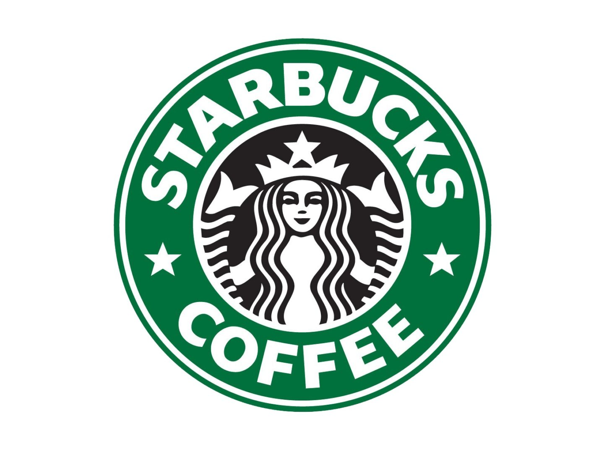
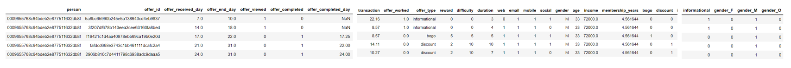
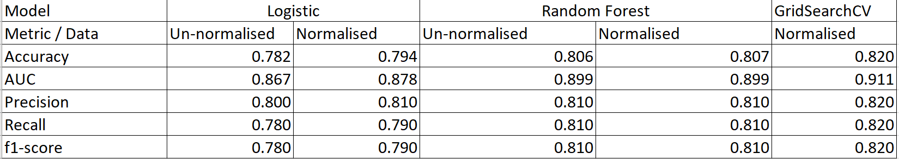
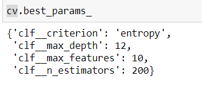
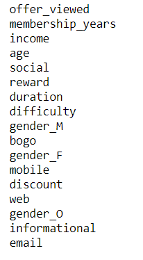

### Table of Contents
1. File Descriptions
2. Project Overview
3. Project Structure
4. Author 
5. References

### File Descriptions
- The Jupyter notebook contains the codes used for creating the machine learning model. 
- prepare_data.py contains the code used to clean, wrangle and format the data. 
- The "data" folder contains the json files for portfolio, profile and transcript for this Udacity final project. 
- The "assets" folder contains the charts and results from the Jupyter Notebook. 

### Project Overview
 
As part of the Udacity Data Science Nanodegree final project, I will undertake the task of analysing Starbucks data regarding promotional offers. 
The aim is to create a machine learning model that can predict whether a promotional offer will be successful.

### Project Motivation
Ever year, millions of dollars are spent in the advertising industry to convince customers to buy product and services that they need/desire. Advertising is a key component of a business's operations
and is huge determinant of business success as it is a means to raise awareness of product availability, entice customers to make purchases and compete with other businesses. 

Given the importance of advertising and promotions, we want to target customers that are most likely to respond favourably to our promotions. Thefore, the project
seeks to predict the likelihood of success of an offer based on a list of key features. 
 
### Project Structure
1. <ins> Data Understanding </ins>

  I will use 3 keydatasets to perform this analysis. Note that <ins>these are not actual data, but rather data generated from a simulation</ins>:

  a) Demographic data - contains following information on Starbucks members: income, age, gender, date in which membership started.

  b) Portfolio data - a schedule that shows the offer type, minimum spend amount to complete an offer, reward for completing an offer, validity period of offer, channel in which offer is provided i.e. social media, mobile, email. 

  c) Transcript data - a record of transactions and amounts spent by the customer, when an offered is viewed or completed along with the timestamp. 

  An offer is deemed as successful if a customer views a given offer and subsequently spends the minimum required amount to complete the offer. There are 3 different types of offers:

  a) BOGO - this is buy one get one free.

  b) Discount - this requires a minimum spend of a certain amount before a discount is given. For example, spending $10 to get $2 off.

  c) Informational - this merely provides information about a product. 

  Each offer has a validity period, during which customers are eligble to view, redeem and complete the offer. Informational offers are assumed to influence the customer for the duration of the offer if
  viewed by the customer. It is assumed that informational offers are successful if a customer views the offer and spends any amount during the validity period. The intuition here is that the customer is
  affected by the information advertised which encourages the customer to make a purchase. 

2. <ins>Prepare Data</ins>

a) Demographic data 
- There are 2,175 rows where the customer's gender and income are missing, and age is 118. These are likely to be errors in the data and thus are removed. 
- The number of years in which a customer has been a member is calculated based on his/her membership date. 
b) Portfolio data
- Using one hot encoding, we create dummy variables as to whether the offer is available through web, email, mobile and social. 4 dummy variables are created. 

c) Transcript data
- There are 33,772 rows related to customers that are not in the demographic dataset. These are removed from the transacript data as there are no customer features to analyse these. 
- The timestamp column is converted to day format. This represents the day since the data is collected. 
- "value" is a string column that contains the offer id if the record is on whether the offer is received, viewed or completed. It contains the amount if the record is a transaction. 
The "amount" and "offer id" columns are created and the values from the "value" column are extracted. 

After performing the above, we use the above datasets to create 2 new datasets: transactions data and offers data.

Transactions data is created by extracting transactions from the transcript data. 

Offers data is created by extracting records related to offers from the transcript data. 

We then create a master dataset containing the following on a line by line basis:

a) person.

b) offer received. 

c) offer received day.

d) offer expiry day.

e) whether the offer was viewed.

f) whether the offer was completed.

g) offer completion day.

h) transaction amount between the offer received day and the earlier of the offer expiry day and the offer completion day.

i) whether the offer worked - for BOGO and discount offers, it is successful (1) if the offer is viewed and subsequently completed. If the offer is completed without having been viewed beforehand, it is considered unsuccessful (0). For informational offers, it is considered successful if the customer spends money during the duration of the offer after vieweing it. 

j) amount that customer needs to spend for the offer.

k) reward that customer gets from the offer.

l) 3 dummy variables for whether the offer is bogo, discount or informational.

m) 3 dummy variables for gender. 

n) 4 dummy variables for whether the offer is through web, email, mobile, social media.  

o) age.

p) income.

q) duration of membership in years. 

Preview of the master dataset is as below:

 

3. <ins>Data Modeling  </ins>

Using the master dataset, we create a model to predict whether the offer worked using the list of predictors below:

a) whether the offer was viewed.

b) duration of offer

c) amount that customer needs to spend for the offer.

d) reward that customer gets from the offer.

e) 3 dummy variables for whether the offer is bogo, discount or informational.

f) 3 dummy variables for gender. 

g) 4 dummy variables for whether the offer is through web, email, mobile, social media. 

h) age.

i) income.

j) duration of membership in years. 

The dataset is split into the train and test dataset using a 50:50 split. Class imbalance was not an issue as 57% of the train data is where the offer worked, and 43% of the train
data is where the offer did not work. 

Our base model is using a Logistic Regression. 

This is then compared to the following models:

a) Random Forest Classifier

b) GridSearchCV

The following metrics are used to compare the performance of the 3 models:

a) accuracy score - measures the percentage in which our model obtained the correct predictions for. 

b) AUC (area under the curve) score - measures the ability of our classifier to distinguish between whether the offer worked (1) or not (0). The higher the AUC, the better the model is at
predicting 1 classes and 0 classes.  

c) precision - measures the proportion of offers that actually worked out of all the offers that the model predicted will work. 

d) recall - measures the ability of our model to spot all the offers that actually worked. 

e) f1-score - a weighted harmonic mean of precision and recall. f1-score can be a better scoring metric than accuracy. Accuracy can be contributed by a large number of true negatives, which 
have a smaller business implication compared to false positives and false negatives. Therefore, f1-score is a better measure for when we want a balance between precision and recall.  

4. <ins>Results</ins>  
Results can be summarised as follows:

 

The Random Forest model with hyperparameters tuned using GridSearchCV produced the best results across all metrics. For the Logistic Regression model, using normalised data for training gave us a better model than using un-normalised data.
Normalised data gave us a marginal improvement in accuracy for Random Forest model.  

5. <ins>Discussion</ins>

Using the MinMaxScaker function from sklearn, we find that normalised data produces better results than running the models on un-normalised data. Normalised data constraints the values 
of a feature such that it is between 0 and 1. Without normalisation, variables that are measured at different scales do not contribute equally to the model fitting. Normalisation helps to 
avoid potential bias in our model. 

Random Forest Classifier gave better results across all metrics than Logistic Regression. Random Forest utilizes ensemble learning by taking random samples and forming many decision trees. Each individual
tree will provide a class prediction and the class with the most votes becomes the model's prediction for the set of features. Also, Random Forest does not assume that the model has a linear relationship. 
Since the majority of our features are categorical dummy variables, Random Forest is more suited than logistic regression, as logistic regression is normally better for continuous variables.

Given the better performance of Random Forest Classifier, we used GridSearchCV to tune the hyperparameters of this classifier to obtain the most optimal parameters that will give us a model with the best
metrics. We selected the below parameters to tune for the Random Forest Classifier. The best parameters for our data after tuning are as below:

a) n_estimators - number of decision trees. The more trees, the more robust the predictions of the model although at a cost of greater training time.

b) criterion - this is the criteria used to split the observations at each node based on a feature. 

c) max_depth - refers to the depth of an individual tree. The deeper the tree, the more the observations are split and the more information about the data it takes into account. In a single tree, this can lead
to overfitting. Since we are using a Random Forest which uses an ensemble of trees, overfitting is less of an issue. 

d) max_features - refers to the number of random features to consider at each split. If we only consider a small number of features at each node, this can lead to reduced variance of the ensemble, but increased bias
for the individual tree. If the number of features is large, then there is a higher likelihood of a quality feature being taken into consideration at the splits. 

Because the Random Forest is an ensemble of trees instead of a linear model, instead of looking at coefficients, we look at the importance of individual features which were used to 
train the Random Forest classifier. Below is the rank of features from most important:

 

The top 5 most important features in determining whether an offer will work are whether the offer viewed, the number of years the customer has been a member, income, age and whether the offer is on social media. 
This makes sense because based on the data during our data exploration stage, those who viewed the offer are more likely to completely the offer. Customer loyalty also plays a key role, as the data shows that offers are 
more likely to work for those that have been members for longer. Also, offer has a higher chance of working for those that are older and have a higher income. Offer will also be more effective 
if on social media.

Therefore, the recommendation based on the results is to invest more in making the offer more visible on the Starbucks app, and also target loyal customers that have been with
Starbucks for a long time, who are older and earn a high income. Also, Starbucks should also invest in making offers available on its social media compared to other channels
like website or email. These will ensure that Starbucks gets a higher return on investment on its offers. 

More details on the findings can be found in the Jupyter notebook [here](https://medium.com/@bryanchen21/londons-airbnb-market-explained-visually-2b9bb4d746aa).

### Author
- **Bryan Chen** - bryanchen21@gmail.com

### References

https://towardsdatascience.com/random-forest-hyperparameters-and-how-to-fine-tune-them-17aee785ee0d

https://www.kdnuggets.com/2016/12/best-metric-measure-accuracy-classification-models.html

https://machinelearningmastery.com/roc-curves-and-precision-recall-curves-for-classification-in-python/

https://developers.google.com/machine-learning/crash-course/classification/roc-and-auc

https://towardsdatascience.com/understanding-auc-roc-curve-68b2303cc9c5

https://towardsdatascience.com/logistic-regression-model-tuning-with-scikit-learn-part-1-425142e01af5

https://towardsdatascience.com/building-a-logistic-regression-in-python-step-by-step-becd4d56c9c8

https://towardsdatascience.com/everything-you-need-to-know-about-min-max-normalization-in-python-b79592732b79

https://www.quora.com/When-should-random-forest-be-used-over-logistic-regression-for-classification-and-vice-versa

https://realpython.com/logistic-regression-python/

https://towardsdatascience.com/is-random-forest-better-than-logistic-regression-a-comparison-7a0f068963e4
